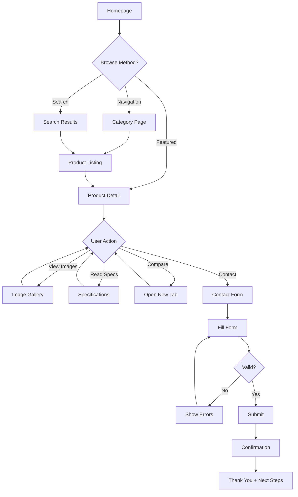
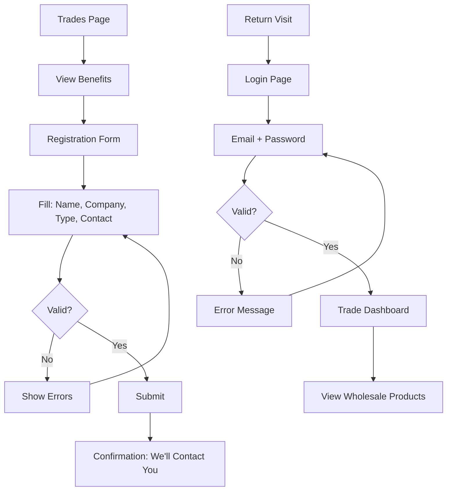

# UX Design Specification hardwoodliving

**Author:** Viet An
**Date:** 2026-02-07

---

## Executive Summary

### Project Vision

Hardwoodliving is transforming from an outdated CodeIgniter 3 website into a modern, high-performance catalog and lead generation platform. The new digital experience must position Hardwoodliving as a **premium boutique brand** for wood flooring and cabinetry in the Canadian market — delivering a warm, nature-oriented "boutique feel" that mirrors the in-store experience.

Unlike e-commerce websites, Hardwoodliving operates as an **online catalog with lead generation focus**. Visitors browse products and prices publicly, but the conversion goal is consultation requests rather than online checkout. Every UX decision should guide users through: **discover products → understand value → submit consultation request**.

### Target Users

| User Type | Profile | Primary Goals | Tech Savvy | Primary Device |
|-----------|---------|---------------|------------|----------------|
| **Retail Customer** | Homeowners seeking premium wood flooring or cabinetry, often recently purchased a home or planning renovation, typically referred by friends or found via search | Browse products by category, compare options (specs, price, images), visualize products in their space, request personalized consultation | Medium — comfortable with modern websites, expects mobile-responsive experience | Mobile for initial browse, desktop/tablet for detailed research |
| **Trade User** | Contractors, installers, interior designers looking for reliable supplier with trade benefits | Register for trade access, view wholesale-only products and pricing, receive technical support and new product updates | Medium-High — uses websites regularly for business purposes | Desktop during work hours, mobile on job sites |
| **Admin** | Business owner (Romeo) and data entry staff managing daily operations | Create/edit products and pages independently, manage media assets, view and export leads for follow-up, no developer dependency | Low-Medium — needs intuitive, forgiving CMS interface | Desktop (Sanity Studio at /admin) |

### Key Design Challenges

1. **Premium Brand vs. Performance Balance**
   - Deliver boutique, warm, nature-oriented visual experience while maintaining Core Web Vitals (LCP < 2.5s on 4G)
   - High-quality imagery must not compromise page load or mobile experience
   - WCAG 2.1 AA accessibility must not dilute premium aesthetic

2. **Catalog Navigation at Scale**
   - Products organized by categories (Flooring, Cabinetry) and subcategories
   - Filtering by category and product type without overwhelming users
   - Mobile navigation must handle multi-level hierarchy gracefully
   - Clear wayfinding with breadcrumbs across all product journeys

3. **Lead Conversion Without E-commerce Friction** *(Confirmed: Strictly catalog + lead gen)*
   - **No cart icon, no checkout flow, no e-commerce functionality** — all conversions are consultation requests
   - CTA placement and messaging must be clear but not pushy
   - Form design must qualify leads (product interest, room type, budget) without abandonment
   - Confirmation experience must set clear expectations for follow-up

4. **Dual Audience Experience**
   - Public visitors and authenticated trade users share same catalog
   - Wholesale-only products visible only to logged-in trade users
   - Trade registration flow must be simple yet capture essential business information
   - No confusion for public users about trade-exclusive content

### Design Opportunities

1. **Immersive Visual Storytelling**
   - Hero sections with nature-oriented imagery reflecting boutique brand
   - Product galleries with room-setting photos help customers visualize
   - Featured products on homepage create immediate brand impression
   - Testimonials add social proof and warmth

2. **Trust-Building Content Journey**
   - Educational content pages (Care Guide, Why Wood?) establish expertise
   - Clear pricing transparency builds confidence (no hidden costs)
   - Prominent contact information and consultation CTAs reduce anxiety
   - Professional yet warm tone throughout copy

3. **Context-Aware Lead Capture**
   - Contact forms can pre-fill product interest from current product page
   - Multiple touchpoints: homepage hero CTA, product page CTAs, dedicated contact page
   - Trade registration with minimal required fields reduces friction
   - Clear confirmation messaging sets follow-up expectations

4. **Mobile-First Premium Experience**
   - 1-column mobile layout prioritizes content readability
   - Touch-friendly navigation with adequate tap targets (≥44×44px)
   - Image galleries optimized for swipe gestures
   - Forms designed for mobile input patterns

## Core User Experience

### Defining Experience

The core experience of Hardwoodliving centers on one critical user flow: **Product Discovery → Evaluation → Consultation Request**. This journey must feel effortless, informative, and premium at every step.

**Primary User Action:** A homeowner lands on a product page, reviews high-quality images and detailed specifications, understands the value proposition, and submits a consultation request within 30 seconds of deciding to reach out.

**Secondary User Actions:**
- Trade users register and access wholesale-only products
- Admins manage content independently through intuitive CMS

The experience succeeds when users feel they've found a trustworthy, premium supplier — not just browsed a catalog.

### Platform Strategy

| Dimension | Strategy |
|-----------|----------|
| **Platform** | Responsive web application (no native app) |
| **Primary Approach** | Mobile-first design with desktop enhancement |
| **Input Methods** | Touch-optimized for mobile, mouse/keyboard for desktop |
| **Offline Support** | Not required (online catalog with real-time CMS content) |
| **Browser Support** | Latest 2 versions of Chrome, Firefox, Safari, Edge |

**Responsive Breakpoints:**
- **Mobile** (< 768px): 1-column layout, hamburger navigation, bottom CTAs
- **Tablet** (768-1024px): 2-column product grid, collapsible navigation
- **Desktop** (≥ 1024px): 3-4 column grid, full navigation, sidebar filters

### Effortless Interactions

| Interaction | Effortless Standard | Implementation Approach |
|-------------|-------------------|------------------------|
| **Product Discovery** | Find any product in ≤ 3 clicks | Clear category hierarchy, persistent breadcrumbs, visible search |
| **Image Viewing** | Instant, smooth, immersive | Optimized images (WebP/AVIF), swipe gallery on mobile, lightbox on desktop |
| **Product Comparison** | Natural multi-product evaluation | Consistent card layout, open-in-new-tab support, sticky key info |
| **Consultation Request** | Complete in ≤ 30 seconds | Pre-filled product interest, minimal required fields (name, email, phone) |
| **Mobile Navigation** | One-thumb operation | Bottom-anchored CTAs, swipe-friendly carousels, collapsible menu |
| **Form Submission** | Zero friction | No captcha, inline validation, clear error messages, retry without data loss |

**Friction Elimination:**
- No account required for browsing or contacting
- No aggressive popups during product browsing
- No hidden pricing or "contact for quote" patterns
- No multi-step forms for simple inquiries

### Critical Success Moments

| Moment | Location | Success Indicator | Failure Risk |
|--------|----------|------------------|--------------|
| **First Impression** | Homepage hero | User perceives premium, trustworthy brand | Generic template feel, slow load |
| **Category Understanding** | Navigation/Catalog | User immediately understands product organization | Confusing categories, too many clicks |
| **Product Evaluation** | Product Detail | User has all info needed to decide | Missing specs, poor images, unclear pricing |
| **Consultation Decision** | CTA interaction | User clicks CTA confidently | CTA hidden, unclear what happens next |
| **Form Completion** | Contact Form | User submits successfully in <30 seconds | Too many fields, validation errors, slow submit |
| **Confirmation Receipt** | Post-submit | User knows exactly what happens next | Unclear confirmation, no timeline expectation |

### Experience Principles

These five principles guide all UX decisions for Hardwoodliving:

1. **Premium First, Fast Always**
   - Every visual choice reflects boutique quality and craftsmanship
   - Performance is never sacrificed for aesthetics (LCP < 2.5s on 4G)
   - High-quality imagery served in optimized formats

2. **Guide, Don't Push**
   - CTAs are present but never aggressive or interruptive
   - Educational content builds trust before asking for contact information
   - Users feel guided through a journey, not pushed into a funnel

3. **One Thumb, Full Access**
   - Mobile users can complete any action with one-handed operation
   - Critical CTAs positioned in thumb-reach zones
   - Navigation and forms optimized for mobile input patterns

4. **Transparency Builds Trust**
   - Pricing displayed publicly on all products (no "contact for price")
   - Complete specifications available without hidden information
   - Clear expectations set for what happens after form submission

5. **Content Informs, Design Inspires**
   - Photography tells the story (room settings, material close-ups, installation results)
   - Copy is concise, informative, and jargon-free
   - Generous white space creates breathing room and premium feel

## Desired Emotional Response

### Primary Emotional Goals

The Hardwoodliving digital experience should evoke these core emotions:

| Emotion | Description | Impact on Experience |
|---------|-------------|---------------------|
| **Trust** | Users feel confident in the quality and reliability of Hardwoodliving as a supplier | Foundation for all conversion — no trust, no consultation request |
| **Warmth** | The experience feels personal, boutique, and welcoming — not corporate or transactional | Differentiates from generic competitors, mirrors in-store experience |
| **Inspiration** | Users can visualize beautiful wood products in their own spaces | Drives emotional connection to products, increases consultation likelihood |
| **Confidence** | Users feel they have all information needed to make informed decisions | Reduces anxiety, increases form completion rate |
| **Accomplishment** | Completing actions (finding products, submitting forms) feels satisfying | Creates positive brand association, encourages return visits |

**Emotional Differentiator:** Visitors leave feeling they've discovered a trustworthy boutique supplier, not just browsed another catalog website.

### Emotional Journey Mapping

| Journey Stage | Location | Target Emotion | Experience Goal |
|---------------|----------|----------------|-----------------|
| **Discovery** | Homepage | Impressed + Intrigued | "This looks premium and professional" |
| **Exploration** | Navigation/Catalog | Curious + Engaged | "I want to explore more" |
| **Evaluation** | Product Detail | Confident + Informed | "I have everything I need to decide" |
| **Decision** | CTA Interaction | Ready + Motivated | "I want to connect with them" |
| **Action** | Form Submission | Effortless + Accomplished | "That was quick and easy" |
| **Confirmation** | Post-Submit | Reassured + Excited | "I know exactly what happens next" |
| **Return** | Subsequent Visits | Familiar + Welcomed | "I remember this experience" |

### Micro-Emotions

Critical subtle emotional states to cultivate:

| Positive State | Negative State | Design Strategy |
|----------------|----------------|-----------------|
| **Confidence** | Confusion | Clear navigation hierarchy, visible pricing, complete specifications |
| **Trust** | Skepticism | Authentic photography, real testimonials, transparent information |
| **Inspiration** | Boredom | Beautiful room-setting imagery, curated featured products |
| **Calm** | Anxiety | No popups, no pressure tactics, generous white space |
| **Accomplishment** | Frustration | Quick form completion, clear feedback, no dead ends |
| **Belonging** | Isolation | Warm copy tone, trade recognition, inclusive language |

### Design Implications

Emotional goals translate to specific UX decisions:

| Emotional Goal | UX Implementation |
|----------------|-------------------|
| **Trust** | Professional photography without stock images; testimonials above the fold on homepage; complete contact information in footer; no dark UX patterns |
| **Warmth** | Earth-tone color palette reflecting natural wood; organic shapes and textures; friendly, conversational copy; breathing room in layout |
| **Confidence** | All pricing visible without "contact for price"; complete product specifications; consistent, polished visual design |
| **Inspiration** | Hero sections with room-setting photography; lifestyle imagery showing installed products; curated featured product collections |
| **Calm** | No modal popups during browsing; no countdown timers or urgency pressure; no "limited stock" messaging; generous white space |
| **Accomplishment** | Forms complete in under 30 seconds; immediate, clear success feedback; explicit next steps in confirmation |

### Emotional Design Principles

These principles ensure emotional goals are maintained across all design decisions:

1. **Authenticity Over Polish**
   - Real product photography beats perfect stock images
   - Genuine testimonials with names and context
   - Honest messaging without exaggeration

2. **Calm Confidence**
   - No urgency tactics or artificial pressure
   - Information presented clearly without overwhelming
   - Users set their own pace through the experience

3. **Warm Professionalism**
   - Premium aesthetic that still feels approachable
   - Expert knowledge shared in accessible language
   - Personal touches that humanize the brand

4. **Transparent Partnership**
   - No hidden information or surprise requirements
   - Clear expectations set at every interaction
   - Users treated as partners, not targets

5. **Effortless Progress**
   - Every action feels lighter than expected
   - Success is celebrated, errors are handled gracefully
   - Momentum maintained throughout the journey

## UX Pattern Analysis & Inspiration

### Inspiring Products Analysis

**Reference Site: Magna Hardwood Floors (magnahardwoodfloors.com)**

As specified in the project requirements, Magna Hardwood Floors serves as the primary reference for structure and functionality. Analysis of similar premium flooring and home improvement websites reveals these successful patterns:

| Product | What They Do Well | Transferable Pattern |
|---------|------------------|---------------------|
| **Magna Hardwood Floors** | Clean product organization, professional photography, clear pricing | Category hierarchy, product card layout, CTA placement |
| **BuildDirect** | Extensive filtering, detailed specs, room visualizer | Product filtering UI, specification tables |
| **Lumber Liquidators** | Sample ordering, installation guides, trade programs | Trade section design, educational content structure |
| **Wayfair** | Image-first browsing, room inspiration, reviews integration | Gallery layouts, social proof placement |

### Transferable UX Patterns

**Navigation Patterns:**
- **Mega Menu Navigation** — Categories visible on hover with subcategory preview, reduces clicks to product
- **Sticky Header** — Logo and primary navigation always accessible, especially on scroll
- **Breadcrumb Trail** — Clear path back to categories, supports exploratory browsing

**Product Display Patterns:**
- **Card-Based Grid** — Consistent thumbnail, title, price format enables quick scanning
- **Quick View Modal** — Preview product without leaving catalog page
- **Image-First Detail** — Large hero image with thumbnail navigation, specs below fold

**Lead Capture Patterns:**
- **Contextual CTAs** — "Get Consultation" appears on product pages with product context
- **Sticky CTA Bar** — Mobile bottom bar keeps action accessible during scroll
- **Progressive Disclosure** — Show minimal form fields, expand only if needed

**Trust-Building Patterns:**
- **Testimonial Cards** — Customer quotes with names and project photos
- **Certification Badges** — Quality certifications visible in footer
- **Contact Accessibility** — Phone number and address always visible

### Anti-Patterns to Avoid

> **Note:** Reference site Magna Hardwood Floors (magnahardwoodfloors.com) was analyzed. Key difference: Magna has "ONLINE STORE" with cart functionality. Hardwoodliving is **strictly catalog + lead gen** with NO e-commerce features.

| Anti-Pattern | Why It Hurts | Prevention |
|--------------|--------------|------------|
| **Cart/Checkout UI** | Confuses users about site purpose, creates false expectations | **No cart icon, no "Add to Cart" buttons, no checkout flow** |
| **"Contact for Price"** | Creates friction, signals hidden costs, reduces trust | Always display public pricing |
| **Aggressive Pop-ups** | Interrupts browsing, creates annoyance, increases bounce | No modals during first 30 seconds, no exit-intent popups |
| **Stock Photography** | Signals generic business, undermines premium positioning | Authentic product and installation photography only |
| **Cluttered Product Pages** | Overwhelms users, hides key information | Prioritized information hierarchy, generous white space |
| **Hidden Contact Info** | Makes contacting difficult, signals inaccessibility | Footer contact visible on all pages, multiple touchpoints |
| **Captcha on Forms** | Creates friction at conversion moment | Server-side spam protection instead |

### Design Inspiration Strategy

**What to Adopt Directly:**
- Card-based product grid with consistent thumbnail, title, price format
- Sticky header with navigation and contact access
- Breadcrumb navigation on all product and content pages
- Footer with complete contact information and trust signals

**What to Adapt:**
- Mega menu pattern simplified for smaller catalog (Flooring, Cabinetry, Content Pages)
- Quick view modal only if user research confirms value
- Testimonials integrated into homepage, not separate page

**What to Avoid:**
- Complex filtering (keep basic category/type filters for MVP)
- Live chat widgets (not in scope, could add post-MVP)
- User-generated reviews (curated testimonials instead)

## Design System Foundation

### Design System Choice

**Selected:** Tailwind CSS with shadcn/ui components

**Rationale:**
1. **Architecture Alignment** — Architecture document specifies Tailwind CSS v4, making shadcn/ui the natural component choice
2. **Customization Flexibility** — Tailwind allows pixel-perfect implementation of client's designs *(Note: Figma designs not yet provided; specification uses proposed visual direction)*
3. **Performance** — Utility-first CSS produces minimal bundle size, supporting Core Web Vitals goals
4. **Developer Velocity** — Single developer can move quickly with familiar patterns
5. **Brand Flexibility** — Not locked into a design system's visual identity

### Implementation Approach

**Foundation Layer:**
- Tailwind CSS v4 with custom configuration
- CSS custom properties for design tokens (colors, spacing, typography)
- shadcn/ui components as starting point, customized to brand

**Component Strategy:**
- Use shadcn/ui for: Button, Input, Card, Dialog, Dropdown, Form, Toast
- Build custom for: ProductCard, ProductGallery, HeroSection, Navigation, Footer
- Extend shadcn/ui for: Breadcrumbs, ContactForm, TradeRegistrationForm

**Design Token Architecture:**

```
Design Tokens (CSS Variables)
├── Colors (brand, semantic, neutral)
├── Typography (font families, sizes, weights, line heights)
├── Spacing (base unit, scale)
├── Shadows (elevation levels)
├── Border Radius (consistent rounding)
└── Transitions (timing, easing)
```

### Customization Strategy

**Brand Customization:**
- Override Tailwind default colors with brand palette
- Custom font stack reflecting premium wood aesthetic
- Spacing scale optimized for content-heavy pages

**Component Customization:**
- shadcn/ui Button with brand colors and hover states
- Form components styled for accessibility (contrast, focus indicators)
- Card components with subtle shadows and rounded corners

## Visual Design Foundation

> **⚠️ IMPORTANT NOTE:** The color palette and visual design tokens below are **PROPOSED** values based on brand positioning analysis. **Figma designs have not yet been provided by the client.** All color values require client (Romeo) approval before implementation. These specifications should be updated once official brand guidelines or Figma designs are received.

### Color System

**Brand Color Strategy:**
Reflecting the warm, nature-oriented boutique identity of Hardwoodliving, the color palette draws from natural wood tones and earthy neutrals.

**Primary Palette:**

| Token | Hex | Usage |
|-------|-----|-------|
| `--color-primary` | `#8B4513` | Primary actions, links, brand accent (Saddle Brown) |
| `--color-primary-dark` | `#5D2E0A` | Hover states, emphasis |
| `--color-primary-light` | `#A0522D` | Backgrounds, subtle accents (Sienna) |

**Neutral Palette:**

| Token | Hex | Usage |
|-------|-----|-------|
| `--color-neutral-50` | `#FAFAF8` | Page backgrounds, cards |
| `--color-neutral-100` | `#F5F5F0` | Subtle backgrounds, dividers |
| `--color-neutral-200` | `#E8E4DE` | Borders, disabled states |
| `--color-neutral-600` | `#6B6B6B` | Secondary text |
| `--color-neutral-800` | `#2D2D2D` | Primary text |
| `--color-neutral-900` | `#1A1A1A` | Headings, emphasis |

**Semantic Colors:**

| Token | Hex | Usage |
|-------|-----|-------|
| `--color-success` | `#2E7D32` | Success messages, confirmations |
| `--color-warning` | `#ED6C02` | Warnings, attention |
| `--color-error` | `#D32F2F` | Errors, destructive actions |
| `--color-info` | `#0288D1` | Informational messages |

**Accessibility Notes:**
- All text colors meet WCAG 2.1 AA contrast ratio (≥4.5:1 for normal text, ≥3:1 for large text)
- Primary color tested for color blindness accessibility
- Focus indicators use high-contrast outline

### Typography System

**Font Strategy:**
Premium, readable typography that balances elegance with web performance.

**Font Stack:**

| Role | Font | Fallback | Usage |
|------|------|----------|-------|
| **Headings** | Playfair Display | Georgia, serif | H1-H3, hero text, brand moments |
| **Body** | Inter | system-ui, sans-serif | Body text, UI elements, forms |
| **Mono** | JetBrains Mono | monospace | Code, specs, technical data |

**Type Scale:**

| Token | Size | Line Height | Weight | Usage |
|-------|------|-------------|--------|-------|
| `--text-xs` | 12px | 1.5 | 400 | Captions, labels |
| `--text-sm` | 14px | 1.5 | 400 | Secondary text, metadata |
| `--text-base` | 16px | 1.6 | 400 | Body text, paragraphs |
| `--text-lg` | 18px | 1.6 | 400 | Lead paragraphs, emphasis |
| `--text-xl` | 20px | 1.4 | 500 | H4, card titles |
| `--text-2xl` | 24px | 1.3 | 600 | H3, section titles |
| `--text-3xl` | 30px | 1.2 | 600 | H2, page titles |
| `--text-4xl` | 36px | 1.1 | 700 | H1, hero headlines |
| `--text-5xl` | 48px | 1.1 | 700 | Display, homepage hero |

### Spacing & Layout Foundation

**Spacing Scale:**
Based on 4px base unit for precise alignment.

| Token | Value | Usage |
|-------|-------|-------|
| `--space-1` | 4px | Tight spacing, inline elements |
| `--space-2` | 8px | Small gaps, icon margins |
| `--space-3` | 12px | Button padding, input padding |
| `--space-4` | 16px | Card padding, standard gaps |
| `--space-6` | 24px | Section padding, larger gaps |
| `--space-8` | 32px | Container padding |
| `--space-12` | 48px | Section margins |
| `--space-16` | 64px | Page sections |
| `--space-24` | 96px | Hero sections, major divisions |

**Layout Grid:**
- **Container Max Width:** 1280px with 16px padding (mobile), 32px (desktop)
- **Product Grid:** 1-column (mobile), 2-column (tablet), 3-4 column (desktop)
- **Content Width:** 720px max for readable text content

### Accessibility Considerations

**Color Accessibility:**
- Primary text on light background: 12.6:1 contrast ratio (exceeds AA)
- Link colors distinguishable without color alone (underline on hover)
- Error states use icon + color + text (not color alone)

**Typography Accessibility:**
- Minimum body text size: 16px
- Line height ≥1.5 for body text
- Font weight ≥400 for readability

**Interactive Accessibility:**
- Focus indicators: 2px solid outline with offset
- Touch targets: Minimum 44×44px
- Skip navigation link for keyboard users

## Design Direction Decision

### Design Directions Explored

Based on the brand positioning (warm, nature-oriented, boutique premium) and technical requirements, the following design directions were considered:

1. **Minimal Elegance** — Clean lines, maximum white space, photography-forward
2. **Warm Organic** — Earth tones, subtle textures, curved elements
3. **Modern Premium** — Bold typography, high contrast, architectural feel
4. **Classic Craftsmanship** — Traditional touches, rich colors, detailed patterns

### Chosen Direction

**Selected: Warm Organic**

This direction best aligns with:
- Brand identity: "Boutique feel," nature-oriented, warm
- Target users: Homeowners seeking premium, personalized experience
- Competitive differentiation: Distinct from generic template-based competitors
- Reference site alignment: Similar to Magna Hardwood Floors' aesthetic

### Design Rationale

| Aspect | Warm Organic Approach |
|--------|----------------------|
| **Layout** | Generous white space, asymmetric grids, breathing room |
| **Color** | Earth tones, warm neutrals, natural wood accents |
| **Typography** | Elegant serif for headings, readable sans-serif for body |
| **Imagery** | Room settings, close-up textures, lifestyle photography |
| **Shapes** | Subtle rounded corners, organic flow |
| **Interaction** | Smooth transitions, gentle hover states |

### Implementation Approach

**Homepage:**
- Full-width hero with room-setting photography
- Featured products in card grid with subtle shadows
- Testimonials with customer photos
- Warm gradient backgrounds for section breaks

**Product Pages:**
- Large image gallery with thumbnail navigation
- Specs in clean, scannable format
- Prominent CTA with subtle hover animation
- Related products at bottom

**Forms:**
- Clean, spacious input fields
- Inline validation with gentle error messaging
- Clear progress indication
- Warm confirmation message

## User Journey Flows

### Retail Customer: Product Discovery to Consultation



**Journey Optimization:**
- Maximum 3 clicks from homepage to consultation form
- Product context auto-fills form when coming from product page
- Form completes in ≤30 seconds

### Trade User: Registration and Access



**Journey Optimization:**
- Registration form requires only essential fields (5 fields)
- Clear expectation setting: "We'll contact you within 24 hours"
- Login remembers email for returning users

### Admin: Content Management

```mermaid
flowchart TD
    A[/admin] --> B[Sanity Studio Login]
    B --> C[Dashboard]
    
    C --> D{Action?}
    D -->|Add Product| E[New Product Form]
    D -->|Edit Product| F[Product List]
    D -->|Manage Pages| G[Pages List]
    D -->|View Leads| H[Inquiries/Trades]
    
    E --> I[Fill Fields + Upload Images]
    F --> J[Select Product]
    J --> I
    I --> K[Preview]
    K --> L{Publish?}
    L -->|No| I
    L -->|Yes| M[Publish]
    M --> N[Live on Site]
    
    G --> O[Select Page]
    O --> P[Edit Rich Text]
    P --> K
    
    H --> Q[View List]
    Q --> R[Export CSV]
```

**Journey Optimization:**
- Sanity Studio provides intuitive content editing
- Preview before publish prevents errors
- CSV export enables marketing workflows

### Journey Patterns

**Navigation Patterns:**
- Consistent header with category links across all pages
- Breadcrumbs on all product and content pages
- Footer with contact info and sitemap links

**Decision Patterns:**
- Clear primary CTA on every product page
- Secondary actions (view more, compare) clearly differentiated
- Mobile bottom bar for persistent CTA access

**Feedback Patterns:**
- Inline form validation with specific error messages
- Loading states for all async actions
- Success confirmations with clear next steps

### Flow Optimization Principles

1. **Minimize Clicks to Value** — 3 clicks max to any product or form
2. **Progressive Disclosure** — Show essential info first, details on demand
3. **Context Preservation** — Product interest carries through to form
4. **Error Recovery** — Clear errors, no data loss, easy retry
5. **Momentum Maintenance** — Always clear next step, no dead ends

## Component Strategy

### Design System Components (from shadcn/ui)

These components will be used directly or with minor customization:

| Component | Usage | Customization Needed |
|-----------|-------|---------------------|
| **Button** | CTAs, form submits, navigation actions | Brand colors, hover states |
| **Input** | Form fields, search | Border radius, focus states |
| **Textarea** | Message fields | Consistent styling with Input |
| **Select** | Dropdowns (category, business type) | Brand styling |
| **Card** | Product cards, content blocks | Shadows, border radius |
| **Dialog** | Image lightbox, confirmations | Overlay opacity, animation |
| **Toast** | Success/error notifications | Brand colors, positioning |
| **Skeleton** | Loading states | Animation timing |
| **Badge** | Featured flags, status indicators | Brand colors |

### Custom Components

**ProductCard**
- **Purpose:** Display product in catalog grid
- **Content:** Thumbnail image, title, price, visibility badge
- **States:** Default, hover (subtle lift), loading (skeleton)
- **Accessibility:** Alt text for image, focusable link wrapper

**ProductGallery**
- **Purpose:** Display product images with navigation
- **Content:** Main image, thumbnail strip, lightbox
- **Actions:** Click thumbnail, swipe (mobile), open lightbox
- **States:** Loading, active thumbnail, lightbox open
- **Accessibility:** Arrow key navigation, alt text, close on Escape

**HeroSection**
- **Purpose:** Homepage hero with brand imagery
- **Content:** Background image, headline, subhead, CTA
- **Variants:** Homepage (full), category page (compact)
- **Accessibility:** Image has alt text, CTA is focusable

**Navigation**
- **Purpose:** Site-wide navigation header
- **Content:** Logo, category links, utility links (Contact, Trades)
- **States:** Default, mobile menu open, scrolled (sticky)
- **Accessibility:** Keyboard navigable, ARIA labels for mobile menu

**MobileMenu**
- **Purpose:** Mobile navigation overlay
- **Content:** Full navigation hierarchy, contact info
- **States:** Closed, open, transitioning
- **Accessibility:** Focus trap when open, Escape to close

**ContactForm** *(Confirmed: 5 fields)*
- **Purpose:** Consultation request form
- **Content:** 
  - Name (required, text input)
  - Email (required, validated email input)
  - Phone (required, validated phone input)
  - Product Interest (optional, **dropdown pre-selected from product page context**)
  - Message (optional, textarea)
- **States:** Empty, filled, validating, submitting, success, error
- **Accessibility:** Label associations, error announcements
- **Hidden field:** Source page URL (for lead tracking)

**Breadcrumbs**
- **Purpose:** Show navigation path
- **Content:** Home > Category > Product
- **Accessibility:** Schema.org BreadcrumbList, proper link semantics

**Footer**
- **Purpose:** Site-wide footer with contact and navigation
- **Content:** Contact info, navigation links, social links, copyright
- **Accessibility:** Proper heading hierarchy, link groups labeled

### Component Implementation Strategy

**Phase 1 — Core (MVP):**
- Navigation, MobileMenu, Footer (layout foundation)
- ProductCard, ProductGallery (product display)
- ContactForm, TradeRegistrationForm (lead capture)
- HeroSection, Breadcrumbs (page structure)

**Phase 2 — Enhancement (Post-MVP):**
- ProductFilter (advanced filtering)
- ProductComparison (side-by-side view)
- SearchAutocomplete (search enhancement)

**Phase 3 — Optimization:**
- LazyImage (advanced image loading)
- InfiniteScroll (catalog pagination)

## UX Consistency Patterns

### Button Hierarchy

| Level | Style | Usage |
|-------|-------|-------|
| **Primary** | Solid brand color, white text | Main CTAs (Get Consultation, Submit, Register) |
| **Secondary** | Outlined, brand color border | Secondary actions (View Details, Learn More) |
| **Tertiary** | Text only, underline on hover | Inline links, cancel actions |
| **Destructive** | Solid red | Delete, remove (admin only) |
| **Disabled** | Gray, reduced opacity | Unavailable actions |

**Button States:**
- Default → Hover (slight darken) → Active (pressed) → Focus (outline)
- Disabled buttons show tooltip explaining why

### Feedback Patterns

| Type | Color | Icon | Duration | Usage |
|------|-------|------|----------|-------|
| **Success** | Green | Checkmark | 5 seconds | Form submitted, action completed |
| **Error** | Red | X mark | Until dismissed | Validation error, submission failed |
| **Warning** | Orange | Warning triangle | Until dismissed | Important notice, potential issue |
| **Info** | Blue | Info circle | 5 seconds | Helpful information, tips |

**Feedback Placement:**
- Form errors: Inline below field + summary at top
- Toast notifications: Bottom-right (desktop), bottom-center (mobile)
- Page-level messages: Top of content area

### Form Patterns

**Field Layout:**
- Single column for mobile
- Two columns for short fields (city + postal) on desktop
- Labels above inputs (not placeholder-only)
- Required indicator: Asterisk (*) with legend

**Validation:**
- Real-time validation after field blur
- Error message appears below field immediately
- Success checkmark appears for valid fields
- Submit button disabled until form valid

**Error Messages:**
- Specific and actionable: "Please enter a valid email address"
- Red text with icon
- Screen reader announces errors

### Navigation Patterns

**Desktop Navigation:**
- Horizontal menu with category dropdowns
- Sticky on scroll (shrinks slightly)
- Contact phone number visible in header

**Mobile Navigation:**
- Hamburger menu (top-right)
- Full-screen overlay when open
- Categories expand in accordion style
- Contact info at bottom of menu

**Breadcrumbs:**
- Always visible on product and content pages
- Home > Category > Subcategory > Product
- Truncated with ellipsis if too long (mobile)

### Loading Patterns

| Context | Pattern |
|---------|---------|
| **Page Load** | Skeleton screens matching content layout |
| **Image Load** | Blurred placeholder (LQIP) → Sharp image |
| **Form Submit** | Button shows spinner, disabled state |
| **Data Fetch** | Inline skeleton for dynamic content |

### Empty State Patterns

| Context | Message | Action |
|---------|---------|--------|
| **No Products in Category** | "No products found in this category" | Link to browse all products |
| **No Search Results** | "No products match your search" | Suggestions, clear filters |
| **No Testimonials** | (Don't show section) | — |

## Responsive Design & Accessibility

### Responsive Strategy

**Mobile First Approach:**
All styles written mobile-first, then enhanced with media queries for larger screens.

**Device-Specific Strategies:**

| Device | Strategy |
|--------|----------|
| **Mobile (<768px)** | Single column, hamburger nav, bottom CTA bar, swipe galleries |
| **Tablet (768-1024px)** | 2-column grids, collapsible nav, touch-optimized interactions |
| **Desktop (≥1024px)** | 3-4 column grids, full navigation, hover states, sidebar filters |

### Breakpoint Strategy

| Breakpoint | Value | Trigger |
|------------|-------|---------|
| `sm` | 640px | Small tablets, large phones landscape |
| `md` | 768px | Tablets portrait, layout shift |
| `lg` | 1024px | Tablets landscape, small laptops |
| `xl` | 1280px | Laptops, desktops |
| `2xl` | 1536px | Large monitors |

**Key Layout Changes:**

| Component | Mobile | Tablet | Desktop |
|-----------|--------|--------|---------|
| **Navigation** | Hamburger menu | Hamburger menu | Full horizontal menu |
| **Product Grid** | 1 column | 2 columns | 3-4 columns |
| **Hero** | Stacked (image above text) | Side by side | Side by side, larger |
| **Footer** | Stacked sections | 2-column | 4-column |
| **Form** | Single column | Single column | Two columns for short fields |

### Accessibility Strategy

**WCAG 2.1 Level AA Compliance**

This is the target accessibility level, meeting all Level A and AA success criteria.

**Key Accessibility Requirements:**

| Requirement | Implementation |
|-------------|----------------|
| **Color Contrast** | 4.5:1 minimum for normal text, 3:1 for large text |
| **Keyboard Navigation** | All interactive elements focusable and operable |
| **Screen Readers** | Semantic HTML, ARIA labels, live regions |
| **Focus Indicators** | Visible 2px outline on all focusable elements |
| **Touch Targets** | Minimum 44×44px for all interactive elements |
| **Form Labels** | Labels programmatically associated with inputs |
| **Error Identification** | Errors identified with text, not just color |
| **Skip Links** | "Skip to main content" link at top of page |
| **Heading Hierarchy** | Proper H1-H6 sequence, no skipped levels |
| **Alt Text** | Meaningful alt text for all informative images |
| **Reduced Motion** | Respect `prefers-reduced-motion` preference |

### Testing Strategy

**Responsive Testing:**
- Chrome DevTools device simulation
- Real device testing: iPhone, Android phone, iPad
- Browser testing: Chrome, Firefox, Safari, Edge

**Accessibility Testing:**
- Automated: axe DevTools, Lighthouse accessibility audit
- Screen reader: VoiceOver (Mac/iOS), NVDA (Windows)
- Keyboard: Tab navigation, Enter/Space activation
- Color: Colorblind simulation tools

**User Testing:**
- Test with actual target users on their devices
- Include users with disabilities when possible
- Validate on real 4G connections for performance

### Implementation Guidelines

**Responsive Development:**
```css
/* Mobile first */
.product-grid {
  display: grid;
  grid-template-columns: 1fr;
  gap: 1rem;
}

/* Tablet */
@media (min-width: 768px) {
  .product-grid {
    grid-template-columns: repeat(2, 1fr);
  }
}

/* Desktop */
@media (min-width: 1024px) {
  .product-grid {
    grid-template-columns: repeat(3, 1fr);
  }
}
```

**Accessibility Development:**
- Use semantic HTML elements (nav, main, article, aside, footer)
- Add ARIA labels only when HTML semantics are insufficient
- Implement keyboard handlers for custom interactive components
- Test with screen reader during development, not just at end

---

## Document Summary

This UX Design Specification provides comprehensive guidance for implementing the Hardwoodliving website with a user-centered, accessible, and premium experience. The document covers:

1. **Project Understanding** — Target users, challenges, and opportunities
2. **Core Experience** — Defining interaction and experience principles
3. **Emotional Design** — Feelings and micro-emotions to cultivate
4. **Pattern Analysis** — Inspiration from successful products
5. **Design System** — Tailwind CSS + shadcn/ui foundation
6. **Visual Foundation** — Colors, typography, spacing
7. **Design Direction** — Warm organic aesthetic
8. **User Journeys** — Flow diagrams for critical paths
9. **Component Strategy** — Custom and design system components
10. **UX Patterns** — Consistency patterns for buttons, forms, feedback
11. **Responsive & Accessibility** — Cross-device and WCAG compliance

**Next Steps:**
1. **Get client approval on proposed color palette** — Figma designs not yet provided; visual direction requires Romeo's sign-off
2. **Confirm contact form fields** — 5 fields specified (Name, Email, Phone, Product Interest dropdown, Message optional)
3. Use this specification to guide Figma design work
4. Reference patterns during frontend development
5. Validate accessibility during implementation
6. Test user journeys with real users before launch

---

## Appendix: Review Notes (2026-02-07)

**Party Mode Review Session Outcomes:**

| Topic | Clarification |
|-------|--------------|
| **Figma Designs** | Not yet provided by client. All visual specifications (colors, typography) are PROPOSED pending approval. |
| **E-commerce Features** | Confirmed: **Strictly catalog + lead gen**. No cart, no checkout, no "Add to Cart" buttons. |
| **Contact Form Fields** | Confirmed: 5 fields — Name (required), Email (required), Phone (required), Product Interest (dropdown, optional, auto-filled from context), Message (optional) |
| **Reference Site** | Magna Hardwood Floors analyzed. Key difference: Magna has e-commerce; Hardwoodliving does not. |
| **Color Palette** | `#8B4513` (Saddle Brown) is proposed based on brand positioning. Requires client approval. |

**Action Items Before Development:**
- [ ] Receive Figma designs from Romeo or get approval on proposed color palette
- [ ] Confirm brand fonts (Playfair Display + Inter proposed)
- [ ] Validate 5-field contact form with client
